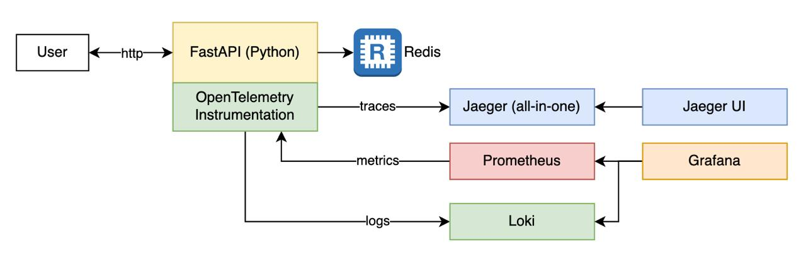

# url-shortener
MercadoLibre technical challenge project.


# Application Overview

The main app is built in Python 3.9 using [FastAPI](https://fastapi.tiangolo.com/) and [OpenTelemetry](https://opentelemetry.io/).

The storage is managed by a [Redis](https://redis.io) container.




# API Endopoints

The endpoints to administrate URLs are as follows:

| Endpoint      | Method | Description                                        | Input                           | Output                            |
|---------------|--------|----------------------------------------------------|---------------------------------|-----------------------------------|
| /url          | POST   | To create shortened URLs.                          | The target URL.                 | The details of the shortened URL. |
| /info{code}   | GET    | To get shortened URL info.                         | The previously genereated code. | The details of the shortened URL. |
| /{code}       | GET    | Forward short URL to original URL.                 |                                 |                                   |
| /delete/{code}| DELETE | Delete (deactivate) the shortened URL by its code. |                                 |                                   |


# Execution

Requeriments:
- Python 3.9
- Docker Compose
- Postman (optional)


In order to forward from `localhost` to `http://me.li` URLs, set up the following `host` in the `/etc/hosts` file in Unix based systems:

```console
## /etc/hosts
# Host Database
#
# localhost is used to configure the loopback interface
# when the system is booting.  Do not change this entry.
##
127.0.0.1       localhost
255.255.255.255 broadcasthost
::1             localhost
0.0.0.0         me.li
```

Then, innitialize the application using docker compose command:

```console
docker compose up --build --force-recreate
```

See the API documentation in the [Swagger](http://me.li/docs) docs site.

Useful links (dockerized apps):
- [Grafana](http://localhost:3000)
- [Jaeger UI](http://localhost:16686)
- [Prometheus](http://localhost:9090)


